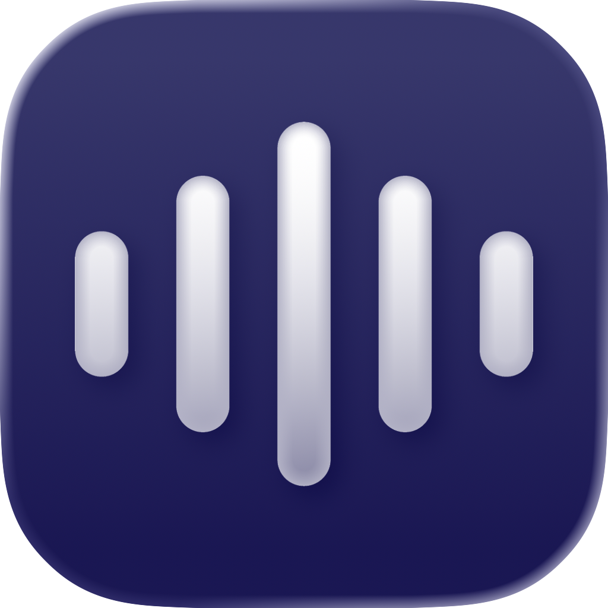

# KeyVox

**KeyVox** is a local-first macOS dictation app. Hold a trigger key to record, release to transcribe with Whisper on-device, and insert text into the active app.

## Why KeyVox

KeyVox is built for low-latency, local transcription with deep macOS integration.

- Local Whisper inference (no cloud transcription path)
- Global modifier-key trigger workflow
- Accessibility-first text insertion with fallback behavior
- Menu bar-first UX with onboarding and settings

## Features

### Performance & AI
- **Local Whisper pipeline**: Uses `whisper.cpp` through the local `KeyVoxWhisper` package.
- **Model artifact**: Uses `ggml-base.bin` (plus CoreML encoder assets when available).
- **Automatic language detection**: Transcription runs with Whisper language `.auto`.
- **Model pre-warming**: Loads model early to reduce first-transcription delay.
- **Phonetic dictionary adherence**: Applies offline post-correction with bundled pronunciation data plus deterministic fallback encoding.

### Text Processing
- **Deterministic list formatting (non-AI)**: Converts spoken numeric lists (e.g., one/two/three, 1/2/3) into numbered output.
- **Single-line aware list fallback**: Uses inline list rendering for single-line targets and multiline rendering for editors.
- **Conservative spoken-marker range**: Spoken number markers currently support `one` through `twelve` to reduce false positives.

### Interaction
- **Configurable trigger binding**: Left/Right Option, Command, Control, or Fn.
- **Default trigger**: **Right Option (⌥)**.
- **Hands-free mode**: Hold **Shift** while releasing trigger to keep recording until trigger is pressed again.
- **Escape to cancel**: Press **Esc** during recording/transcribing to abort.

### Injection & Feedback
- **Accessibility-first insertion**: Attempts direct insertion in focused controls.
- **Fallback insertion**: Uses menu-bar Paste automation when direct insertion is unavailable.
- **Paste-failure recovery**: If both insertion paths fail, shows a recovery overlay with an indigo progress bar, `⌘V` guidance, and manual dismiss.
- **Overlay feedback**: Floating recording/transcribing overlay with persisted position.
- **Audio cues**: Start/stop/cancel sounds (when enabled).

### App Operations
- **Onboarding flow**: Microphone, Accessibility, and model setup on first launch.
- **Update checks**: Manual and timer-based checks backed by GitHub Releases metadata via `Core/Services/AppUpdateService.swift`.
- **Warnings**: In-app warning overlays for model/accessibility/microphone issues plus paste-recovery feedback.

## Architecture

KeyVox is organized by responsibility:

- **`App/KeyVoxApp.swift`**: app entry point, menu bar scene, window lifecycle.
- **`Core/TranscriptionManager.swift`**: central recording/transcription state machine.
- **`Core/AudioRecorder.swift`**: 16kHz mono audio capture pipeline.
- **`Core/KeyboardMonitor.swift`**: global/local modifier and escape monitoring.
- **`Core/Overlay/OverlayManager.swift`**: overlay lifecycle orchestration, panel wiring, and visibility state.
- **`Core/Overlay/OverlayMotionController.swift`**: fling/reset motion sequencing and overshoot/settle animation flow.
- **`Core/Overlay/OverlayScreenPersistence.swift`**: per-display origin persistence, clamping, and preferred-display recovery.
- **`Core/Overlay/OverlayPanel.swift`**: panel-level drag sampling, double-click reset detection, and release velocity capture.
- **`Core/Overlay/OverlayFlingPhysics.swift`**: pure fling impact/reflection/duration calculations.
- **`Core/Services/WhisperService.swift`**: model loading and local transcription.
- **`Core/TranscriptionPostProcessor.swift`**: post-transcription pipeline orchestration.
- **`Core/AI/Dictionary/DictionaryMatcher.swift`**: offline n-gram custom-word matching with balanced scoring/guardrails.
- **`Core/AI/Dictionary/*`**: dictionary domain internals (storage, matcher components, normalization) are modularized here; see `CODEMAP.md` for the complete file-level map.
- **`Core/TextProcessing/ListFormattingEngine.swift`**: deterministic numeric list detection/rendering layer.
- **`Core/Services/Paste/PasteService.swift`**: text insertion orchestrator (AX insert, menu fallback, clipboard restore).
- **`Core/Services/Paste/PasteFailureRecoveryCoordinator.swift`**: failed-paste recovery window lifecycle and Command-V detection.
- **`Core/Services/AppUpdateService.swift`**: GitHub Releases polling and update prompt triggers.
- **`Core/Services/UpdateFeedConfig.swift`**: tracked default update feed config plus optional local override resolution.
- **`Core/Services/AppUpdateLogic.swift`**: pure update parsing/version/host validation helpers.
- **`Views/RecordingOverlay.swift` + `Views/Components/KeyVoxLogo.swift`**: branded visual identity layer.

### Post-Processing Order
1. Whisper returns raw transcript text.
2. Dictionary correction applies custom-word adherence.
3. List formatting applies numeric list rendering when confident.
4. Final text is inserted via Accessibility-first paste flow.

### Contributor Notes
- Behavior and motion constants should stay close to their owning logic (file-local constants in managers/services/views).
- Branded visual tuning intentionally stays inside proprietary files like `Views/RecordingOverlay.swift` and `Views/Components/KeyVoxLogo.swift`.
- This split reduces fork confusion and keeps licensing boundaries clear without extra license bookkeeping.
- Unit tests focus on deterministic/runtime-safe logic; hardware and OS-event integrations remain integration-test territory.

## Update Service

`Core/Services/AppUpdateService.swift` is the single update source-of-truth integration.

- Fetches latest release metadata from the GitHub Releases "latest release" API endpoint configured by `Core/Services/UpdateFeedConfig.swift`.
- Uses `tag_name` for version detection (normalizes `v1.2.3` -> `1.2.3` before comparison).
- Uses release `body` as the in-app update message/changelog text.
- Uses the first `.dmg` asset `browser_download_url` for the update button when available; otherwise falls back to release `html_url`.
- Keeps timer-based and manual checks, with silent failure behavior if the API is unavailable or payload decoding fails.
- Optional local override file for maintainer testing: `~/Library/Application Support/KeyVox/update-feed.override.json`.
- Optional helper script for setting/clearing/showing local override: `Tools/UpdateFeed/configure_local_feed.sh`.
- Example override template (committed): `Tools/UpdateFeed/update-feed.override.example.json`.

### Local Update Feed Workflow (Maintainers)
- Tracked default update feed lives in `Core/Services/UpdateFeedConfig.swift` and should remain production-facing.
- To test against a different repo locally, set an override (not committed):
  - `Tools/UpdateFeed/configure_local_feed.sh set <owner> <repo>`
- To inspect current local override:
  - `Tools/UpdateFeed/configure_local_feed.sh show`
- To return to tracked default behavior:
  - `Tools/UpdateFeed/configure_local_feed.sh clear`
- Runtime resolution order:
  - If `~/Library/Application Support/KeyVox/update-feed.override.json` exists, the app uses it.
  - If it does not exist, the app uses tracked defaults from `UpdateFeedConfig.swift`.

## Testing & Quality Gates

- App unit tests:  
  `xcodebuild -project KeyVox.xcodeproj -scheme "KeyVox DEBUG" -configuration Debug -destination 'platform=macOS' -enableCodeCoverage YES CODE_SIGNING_ALLOWED=NO CODE_SIGNING_REQUIRED=NO -resultBundlePath /tmp/keyvox-tests.xcresult test`
- Package unit tests (`KeyVoxWhisper`):  
  `swift test --package-path Packages/KeyVoxWhisper`
- Core coverage gate (allowlisted deterministic files, threshold default `80%`):  
  `Tools/Quality/check_core_coverage.sh /tmp/keyvox-tests.xcresult`

### Integration-Only Exclusions
- Audio capture hardware/runtime behavior (`Core/AudioRecorder.swift`)
- Global keyboard hook behavior (`Core/KeyboardMonitor.swift`)
- Overlay window rendering/interaction details (`Core/Overlay/OverlayManager.swift`, `Core/Overlay/OverlayPanel.swift`, `Views/RecordingOverlay.swift`)

### KeyVoxWhisper Wrapper
`Packages/KeyVoxWhisper` is the project-local Swift wrapper around official `whisper.cpp` binaries. It isolates upstream compatibility churn behind a stable Swift interface used by app code.

## Pronunciation Resources

- Bundled pronunciation resources live in `Resources/Pronunciation/`.
- Runtime never downloads lexicon assets; matching is fully offline.
- Maintainers regenerate resources with `Tools/Pronunciation/build_lexicon.sh`.
- Source snapshot pins/checksums live in `Resources/Pronunciation/sources.lock.json`.
- Source/license attribution is tracked in `Resources/Pronunciation/LICENSES.md`.
- License/source policy check: `Tools/Pronunciation/verify_licenses.sh`.
- Quality gate check: `Tools/Pronunciation/benchmarks/run_quality_gates.sh`.
- Production targets:
  - `lexicon-v1.tsv` target: `240,000+` rows (allowed range: `240,000-450,000`).
  - `common-words-v1.txt` range: `10,000-15,000` rows.
  - coverage >= `95%`, correction hit-rate >= `90%` (`>=80%` if Phonetisaurus is unavailable and fallback G2P is used), false positives <= `1%`, median matcher latency <= `10ms`.

## Repository Structure

High-level layout:

- `App/`
- `Core/`
- `Views/`
- `Resources/`
- `Packages/`

For a detailed map of files and component responsibilities, see [`CODEMAP.md`](CODEMAP.md).

## Getting Started

### Prerequisites
- **macOS 15.6 or later**
- Apple Silicon recommended for best performance (Intel supported)

### Installation
1. Clone the repository: `git clone https://github.com/macmixing/keyvox.git`
2. Open `KeyVox.xcodeproj` in Xcode.
3. Build and run.
4. Complete onboarding to grant permissions and download model assets.

## Usage

1. **Configure**: Pick your trigger key in Settings (Default: **Right Option (⌥)**).
2. **Standard dictation**: Hold trigger -> speak -> release to transcribe and insert.
3. **Hands-free**: Hold trigger -> hold **Shift** -> release trigger -> press trigger again to stop.
4. **Cancel**: Press **Esc** to abort the active session.

## Troubleshooting

- **Model missing**: Open Settings and download/retry model setup.
- **No text insertion**: Verify Accessibility permission in System Settings.
- **No input audio**: Verify microphone permission and selected microphone in Settings.

## License

KeyVox uses a dual-license model:

- **Source code** is MIT-licensed.
- **Branding and specified visual assets** are excluded and remain proprietary.

See [`LICENSE.md`](LICENSE.md) for exact terms and the full list of excluded files/assets.
