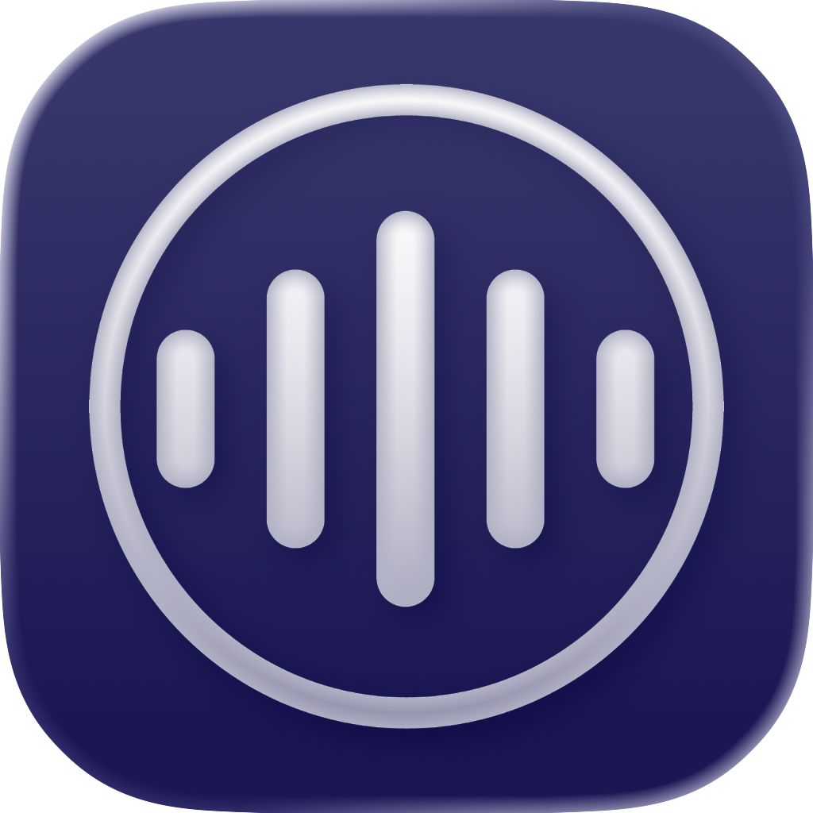

  

<h1 align="center">KeyVox</h1>

  
  
  
  
  

KeyVox is a local-first macOS and iPhone AI-powered dictation app with on-device Whisper and Parakeet transcription models. 

KeyVox for Mac is simple. Hold your trigger key to record, release to transcribe on-device with Whisper or Parakeet, and insert text into the app you are currently using. Your custom dictionary, key dictation style settings, and weekly word total can also stay in sync across your devices with iCloud.

KeyVox for iPhone brings the same speech-to-text workflow from the Mac app into a mobile experience, with on-device transcription, post-processing,  shared dictionary via iCloud and synced preferences.

## Download for iOS

🎉 **KeyVox Keyboard** is available for iPhone: [Free on the App Store](https://apps.apple.com/us/app/keyvox-ai-voice-keyboard/id6760396964?ct=github-readme&mt=8)

## Why KeyVox

- 🚀 Fast local transcription (no cloud transcription path)
- 🌍 Includes on-device Whisper and Parakeet transcription models 
- 🖥️ Parakeet works on Sonoma and later, Whisper works on Ventura and later. Both on iOS 18.6+.
- 🔒 Privacy-first workflow with on-device inference
- ⌨️ Global trigger-key dictation from anywhere on macOS
- 🧠 Smart post-processing for custom words, lists, and time formatting
- ☁️ iCloud sync for your custom dictionary and core dictation preferences
- 📊 See your weekly spoken-word total across devices
- 🪄 Reliable insertion flow with Accessibility-first + fallback paths on macOS
- 💪 Native and reliable iOS implementation with keyboard extension

## Core Features

- 🎙️ Hold-to-talk dictation with optional hands-free mode on macOS
- 🎙️ Tap-to-talk dictation on iPhone
- 🧾 Custom dictionary with phonetic-aware matching and iCloud sync
- ⚙️ Configurable trigger binding (Option, Command, Control, or Fn), synced across devices
- 📓 Optional auto-paragraph splitting with Lists preferences with sync
- 🧱 Deterministic list formatting and safe text post-processing
- 📈 Weekly word count that reflects how much you talk across all devices
- 📍 Draggable recording overlay with persisted position
- 🔊 Optional system cue sounds with adjustable volume
- ⚠️ Recovery and warning overlays for insertion/audio edge cases

https://github.com/user-attachments/assets/891f6354-55c2-4f7f-9ebc-2fa6bbfe7b0b

## Quick Start

### Requirements

macOS
- macOS Ventura (13.5) or later
- Apple Silicon recommended (Intel supported)
- ~190–480 MB of disk space, depending on the installed dictation model

iOS
- iOS 18.6 or later
- ~190–480 MB of disk space, depending on the installed dictation model

### Install and Run

### Recommended ( macOS Release DMG)

1. Download the `.dmg` from the [latest release](https://github.com/macmixing/keyvox/releases/latest).
2. Open the DMG and drag `KeyVox.app` to `Applications`.
3. Launch KeyVox and complete onboarding (Microphone, Accessibility, dictation model setup).

### Build From Source (macOS/iOS):

1. Clone the repo:
   `git clone https://github.com/macmixing/keyvox.git`
2. Open:
   `macOS/KeyVox.xcodeproj` or `iOS/KeyVox iOS/KeyVox iOS.xcodeproj`
3. Build and run in Xcode.
4. Complete onboarding:
   Model download, Microphone permission, and Accessibility/keyboard permission.
   

## How to Use (macOS)

1. Configure your trigger key in Settings (default is **Right Option ⌥**).
2. Hold trigger, speak, release to transcribe and insert.
3. Hold **Shift** while releasing to continue recording hands-free.
4. Press **Esc** to cancel an active recording/transcription session.

## How to Use (iPhone)

1. Tap microphone icon on keyboard to start recording, tap again to stop and transcribe.
2. Tap the cancel button on the keyboard toolbar to cancel recording.

## Dictionary & Settings

- Custom Dictionary entries can be added on either platform and will sync across devices via iCloud.
- Automatic **Paragraphs** and **Lists** can be configured in Settings. (Enabled by default)

## KeyVox Speak (iOS)

KeyVox Speak brings local AI text-to-speech to iPhone, letting you copy text and hear it spoken aloud with natural-sounding voices powered by on-device PocketTTS.

### What is KeyVox Speak?

**Copy text. Hear it speak.** KeyVox Speak is a text-to-speech feature that runs entirely on your device using local AI voices. No cloud processing, no data sent anywhere—just fast, private playback of any text you copy.

### How to Access Speak

KeyVox Speak is available from multiple places on iPhone:

- **Home Tab**: Tap the Speak button from the main screen
- **Keyboard Shortcut**: Trigger directly from the KeyVox keyboard
- **Share to Speak**: Share text, URLs, or images with text from any app
- **Shortcuts & Actions**: Map to Action Button or Control Center for quick access

### Fast Mode

Fast Mode starts speaking ~50% faster by skipping the initial voice warm-up. Toggle Fast Mode in the Speak toolbar when you need instant playback.

### Free to Start

KeyVox Speak is free to try with 2 speaks per day. Install the Alba voice (~19 MB) and start speaking right away. You can download up to 8 total voices in Settings.

To unlock unlimited speaks, purchase KeyVox Speak access once and use it across all your devices on the same Apple account.

### Requirements

- **PocketTTS CoreML** (~642 MB): The shared AI engine that powers all voices
- **Voice files** (~17-19 MB each): Individual voice models like Alba, Azelma, Cosette, and more

Both components install on-device and run locally with no internet connection required for playback.

## Troubleshooting

- ❌ No text inserted:
  Verify Accessibility permission in macOS System Settings or Keyboard Settings on iOS.
- 🎤 No input audio:
  Verify microphone permission and selected input in Settings on macOS or microphone access in iOS Settings.
- 📦 Dictation model missing:
  Open Settings and re-run dictation model setup/download on macOS, reinstall on iOS.

## Documentation

- 📘 macOS Engineering details: [`macOS/Docs/ENGINEERING.md`](macOS/Docs/ENGINEERING.md)
- 🗺️ macOS File/component map: [`macOS/Docs/CODEMAP.md`](macOS/Docs/CODEMAP.md)
- 📘 iOS Engineering details: [`iOS/Docs/ENGINEERING.md`](iOS/Docs/ENGINEERING.md)
- 🗺️ iOS File/component map: [`iOS/Docs/CODEMAP.md`](iOS/Docs/CODEMAP.md)
- 📜 License terms: [`LICENSE.md`](LICENSE.md)
- 📄 Trademark policy: [`TRADEMARK.md`](TRADEMARK.md)
- 📎 Third-party notices: [`THIRD_PARTY_NOTICES.md`](THIRD_PARTY_NOTICES.md)

## License

KeyVox uses a dual-license model:

- Source code is MIT-licensed.
- Branding and specified visual assets remain proprietary.
- Bundled third-party components/data/fonts remain under their original licenses.
