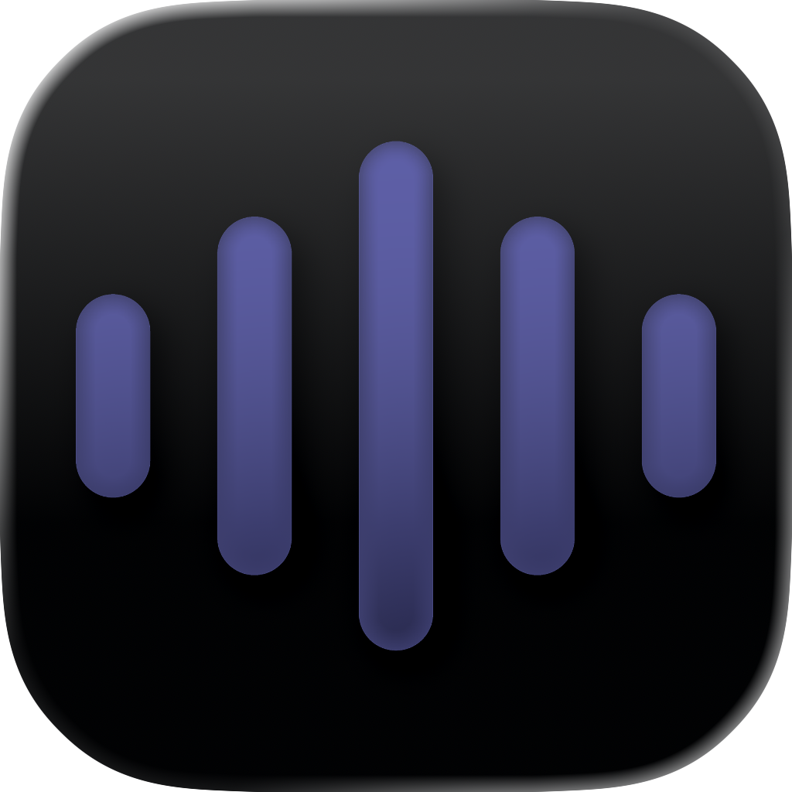

# KeyVox

**KeyVox** is a premium, high-performance macOS application that brings seamless, local voice-to-text transcription to your fingertips. Built with a focus on speed, privacy, and rich aesthetics, KeyVox allows you to dictate text into any application instantly using OpenAI's Whisper model—running entirely on your machine.

---

## Features

### Performance & AI
- **OpenAI Whisper Base**: Uses the high-accuracy **Base English** model locally for superior transcription compared to tiny models.
- **Instant Trigger**: Hold a configurable modifier key (Option, Command, Control, or Fn) to record, release to transcribe.
- **Universal Acceleration**: Leverages **CoreML** (Neural Engine) on Apple Silicon and **Accelerate Framework** on Intel Macs for high-performance inference.
- **Model Pre-warming**: Eliminates "first-run" latency by keeping the model warm in memory.
- **Local & Private**: 100% on-device processing using `whisper.cpp`. No data is ever sent to the cloud.

### Premium User Experience
- **Redesigned Settings**: A stunning, glassmorphic dashboard featuring the **Kanit Medium** font, animated wave headers, and real-time synchronized status tracking.
- **Interactive Visuals**: A beautiful, audio-reactive floating overlay with glassmorphism aesthetics and ripple animations.
- **Smart Feedback**: Low-latency Morse-code ("Morse") and Frog ("Frog") sound feedback for non-visual status updates.
- **Real-time Status Sync**: Coordinated model status between the Menu Bar and Settings window via a global singleton architecture.

### Advanced Interaction
- **Hands-Free Mode**: Hold **Shift** while releasing your trigger key to lock recording. Press the trigger key again to stop and transcribe.
- **Escape to Cancel**: Instantly discard any active recording or transcription session by pressing the **Esc** key.
- **Accessibility First**: Uses the macOS Accessibility API for surgical text injection into native application fields.
- **Intelligent Fallback**: Automatic "Menu Bar Paste" simulation for web-based editors or restricted apps.

---

## Architecture

KeyVox follows a modular, service-oriented architecture designed for low-latency performance:

- **`TranscriptionManager`**: The central coordinator managing the state machine (IDLE → RECORDING → TRANSCRIBING).
- **`WhisperService`**: Manages the Whisper GGML/CoreML model lifecycle and inference threading.
- **`AudioRecorder`**: Captures high-fidelity 16kHz mono audio directly into memory buffers.
- **`PasteService`**: A sophisticated injection engine that bridges native accessibility and UI-simulated fallbacks.
- **`KeyboardMonitor`**: A global event tap using `NSEvent.addGlobalMonitorForEvents` to catch triggers and special modifiers (Shift, Escape).
- **`ModelDownloader`**: Shared singleton handling parallel, animated downloads of AI assets.

---

## Getting Started & Onboarding

### First Launch Experience
KeyVox features a guided, 3-step onboarding flow that appears automatically on your first launch. This ensures your environment is perfectly configured for local AI processing.

1.  **Welcome**: Introduction to KeyVox's local-first philosophy.
2.  **Permissions Check**:
    *   **Microphone**: Required to capture audio. If denied, you must enable it in *System Settings > Privacy & Security > Microphone*.
    *   **Accessibility**: Required to inject text into other apps. Enabling this allows KeyVox to paste directly at your cursor.
3.  **Model Download**: KeyVox automatically downloads the optimized **OpenAI Whisper Base** model (~142MB). This happens entirely within the onboarding window with a real-time progress bar.

### Prerequisites
- **macOS 15.0 or later**
- **Apple Silicon (M1/M2/M3)** recommended for best performance. Intel Macs are supported via Accelerate framework.

### Installation
1.  Clone the repository: `git clone https://github.com/macmixing/keyvox.git`
2.  Open `KeyVox.xcodeproj` in Xcode.
3.  Build and Run.
4.  Follow the **on-screen onboarding guide** to set up permissions and download the AI model.
    *   *Note: If you skip onboarding or need to re-download the model, you can access these controls anytime from the **Settings** menu.*

---

## Usage

1. **Configure**: Set your preferred **Trigger Key** in Settings (Default: Left Option).
2. **Standard Dictation**: Press and hold trigger → Speak → Release to paste.
3. **Hands-Free**: Press and hold trigger → Hold **Shift** → Release trigger (Recording continues) → Press trigger again to stop.
4. **Cancel**: Press **Esc** at any time to kill the session and discard any audio.

---

## Troubleshooting

- **"Model missing" won't clear?** Ensure you've completed the download in Settings. The menu bar status is synchronized automatically.
- **Text not pasting?** Ensure KeyVox is enabled in *System Settings > Privacy & Security > Accessibility*.

---

## License

This project is licensed under the MIT License.

---

Developed with love for the macOS community.
