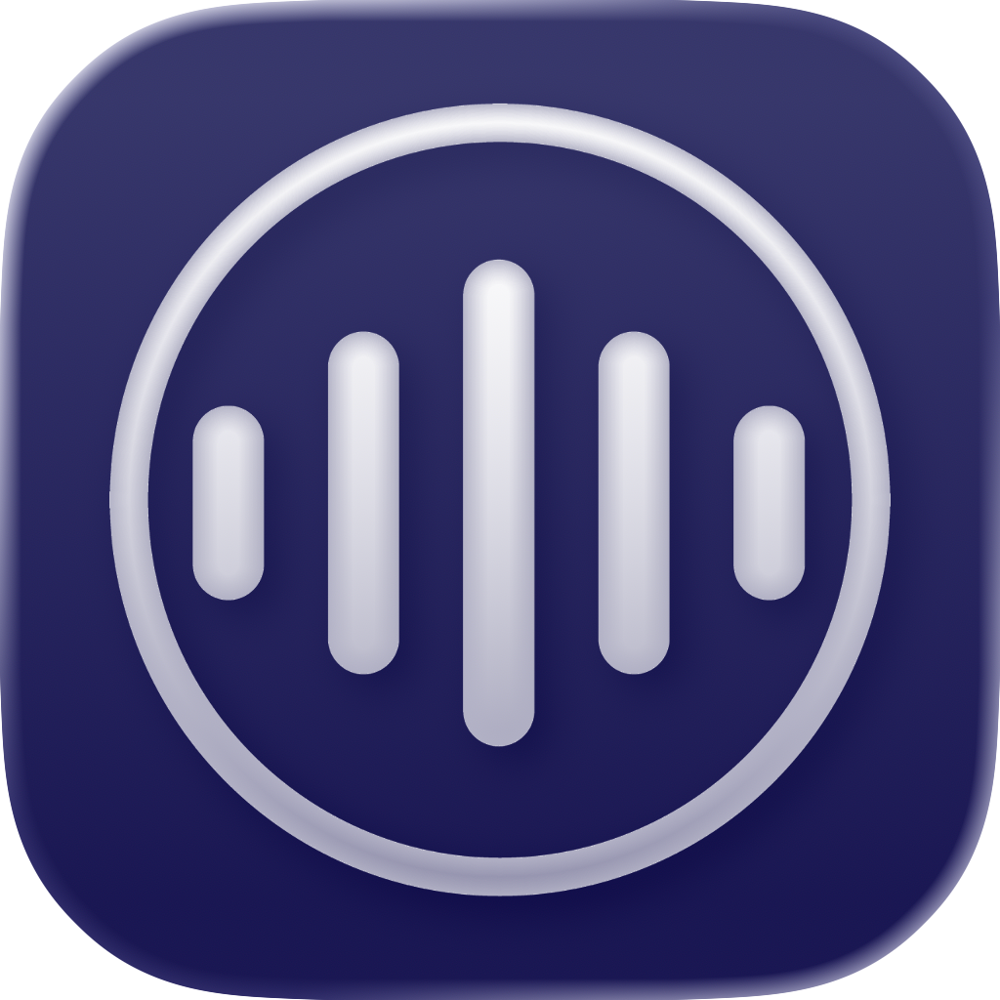

  

<h1 align="center">KeyVox</h1>

  
  
  
  
  

KeyVox is a local-first macOS and iOS AI-powered dictation app with on-device Whisper and Parakeet transcription models. 

KeyVox for Mac is simple. Hold your trigger key to record, release to transcribe on-device with Whisper or Parakeet, and insert text into the app you are currently using. Your custom dictionary, key dictation style settings, and weekly word total can also stay in sync across your devices with iCloud.

KeyVox for iOS brings the same speech-to-text workflow from the Mac app into a mobile experience, with on-device transcription, post-processing, shared dictionary via iCloud and synced preferences.

## Download for iOS

🎉 **KeyVox Keyboard** is available: [**Free on the App Store**](https://apps.apple.com/us/app/keyvox-ai-voice-keyboard/id6760396964?ct=github-readme&mt=8)

## Why KeyVox

- 🚀 Fast local transcription (no cloud transcription path)
- 🌍 Includes on-device Whisper and Parakeet transcription models 
- 🖥️ Parakeet works on Sonoma and later, Whisper works on Ventura and later. Both on iOS 18.6+.
- ♥️ On-device, reversible writing styles on macOS and iOS
- 🔒 Privacy-first workflow with on-device inference
- ⌨️ Global trigger-key dictation from anywhere on macOS
- ↩️ Reversible Lists and Paragraphs for your latest untouched dictation on macOS and iOS
- 🧠 Smart post-processing for custom words, lists, and time formatting
- ☁️ iCloud sync for your custom dictionary and core dictation preferences
- 📊 See your weekly spoken-word total across devices
- 🪄 Reliable insertion flow with Accessibility-first + fallback paths on macOS
- 💪 Native and reliable iOS implementation with keyboard extension

## Core Features

- 🎙️ Hold-to-talk dictation with optional hands-free mode on macOS
- 🎙️ Tap-to-talk dictation on iOS
- ⚡ Background iOS dictation from the Action Button, Control Center, or Shortcuts
- 🧾 Custom dictionary with phonetic-aware matching and iCloud sync
- ♥️ KeyVox Vibes (macOS/iOS) - Pick a style, change your mind later
- 🔈 KeyVox Speak (iOS) - On-device text-to-speech with 8 AI voices to choose from
- ⚙️ Configurable trigger binding (Option, Command, Control, or Fn), synced across devices
- 📓 Optional auto-paragraph splitting with Lists preferences with sync
- 🧱 Deterministic list formatting and safe text post-processing
- 📈 Weekly word count that reflects how much you talk across all devices
- 📍 Draggable recording overlay with persisted position
- 🔊 Optional system cue sounds with adjustable volume
- ⚠️ Recovery and warning overlays for insertion/audio edge cases

https://github.com/user-attachments/assets/891f6354-55c2-4f7f-9ebc-2fa6bbfe7b0b

## What is KeyVox Vibes?

**Choose a style. Change your mind.** KeyVox Vibes lets you apply on-device, reversible writing styles to dictated text on Mac and iOS. Pick None, Casual, Polished, or Chill before dictation ends, and KeyVox applies that Vibe before inserting your text.

### Long Press or Tap to Vibe

Vibes are reversible when the latest inserted dictation is untouched:

- 📱 On iOS, **long press the Vibes key** to undo the last Vibe change.
- 📱 On iOS, **tap to choose another Vibe, then long press** to restyle the same untouched text.
- 💻 On Mac, **tap the trigger key** to apply or undo the current Vibe, and **double-tap** to cycle Vibes.

This means you can dictate first, decide later, and switch between clean dictation and styled text without re-recording.

### Local and Private

Vibes run on-device using KeyVox Vibes AI, a local rewrite model with bundled KeyVox style adapters, plus KeyVox's deterministic formatting pipeline. None keeps normal post-processed dictation, Casual performs light cleanup, Polished rewrites toward a professional tone, and Chill performs cleanup followed by lowercase formatting with limited punctuation.

On Mac, KeyVox Vibes is free and requires installing KeyVox Vibes AI (~491 MB). Mac Vibes can run on macOS Ventura and later: Sequoia and newer may use Metal/GPU acceleration, while Ventura and Sonoma run Vibes on CPU only.

On iOS, KeyVox Vibes requires the local Vibes AI model and supported iOS version. You can try Vibes for 3 days, then unlock KeyVox Vibes once and use it without a subscription.

## What is KeyVox Speak? (iOS)

**Copy text. Hear it speak.** KeyVox Speak is a text-to-speech feature that runs entirely on your device using local AI voices. No cloud processing, no data sent anywhere. Just reliable, private playback of any text you copy.

### How to Access Speak

KeyVox Speak is available from multiple places on iOS:

- **Home Tab**: Tap the Speak button from the main screen
- **Keyboard Shortcut**: Trigger directly from the KeyVox keyboard
- **Share to Speak**: Share text, URLs, or images with text from any app
- **Shortcuts & Actions**: Map to Action Button or Control Center for quick access

### Fast Mode

Fast Mode starts speaking ~50% faster. Toggle Fast Mode in the toolbar when you need quicker playback and don't mind hanging out inside the app longer.

### Free to Start

KeyVox Speak is free to try with 2 speaks per day. Install the Theo voice (~19 MB) and start speaking right away. You can download up to 8 total voices in Settings.

To unlock unlimited speaks, purchase KeyVox Speak access once and use it across all your devices on the same Apple account.

**For more information** on KeyVox Speak, visit [our website](https://keyvox.app/speak).

## Quick Start

### Requirements

macOS
- macOS Ventura (13.5) or later
- Apple Silicon recommended (Intel supported)
- ~190–480 MB of disk space, depending on the installed dictation model
- Optional KeyVox Vibes AI model is ~491 MB

iOS
- iOS 18.6 or later
- ~190–480 MB of disk space, depending on the installed dictation model
- Optional KeyVox Vibes AI model is ~491 MB
- Optional KeyVox Speak shared engine is ~642 MB
- Optional KeyVox Speak voices are ~17-19 MB each

### Install and Run

### Recommended (macOS Release DMG)

1. Download the `.dmg` from the [latest release](https://github.com/macmixing/keyvox/releases/latest).
2. Open the DMG and drag `KeyVox.app` to `Applications`.
3. Launch KeyVox and complete onboarding (Microphone, Accessibility, dictation model setup).

### Build From Source (macOS/iOS):

1. Clone the repo:
   `git clone https://github.com/macmixing/keyvox.git`
2. Open:
   `macOS/KeyVox.xcodeproj` or `iOS/KeyVox iOS/KeyVox iOS.xcodeproj`
3. Build and run in Xcode.
4. Complete onboarding:
   Model download, Microphone permission, and Accessibility/keyboard permission.
   

## How to Use (macOS)

1. Configure your trigger key in Settings (default is **Right Option ⌥**).
2. Hold trigger, speak, release to transcribe and insert.
3. Hold **Shift** while releasing to continue recording hands-free.
4. Press **Esc** to cancel an active recording/transcription session.

### Reverse Lists and Paragraphs (macOS)

You can change the List or Paragraph formatting of your latest untouched dictation without recording it again:

- Hold your configured trigger key and press **L** to toggle List formatting.
- Hold your configured trigger key and press **P** to toggle Paragraph formatting.
- Repeat the shortcut to reverse the change.

The overlay pill shows whether the requested format is on or off. If the dictation has been edited or removed, the format is shown as off and cannot be changed. These shortcuts affect only the latest eligible dictation and never change your saved Lists or Paragraphs preferences.

## How to Use (iOS)

1. Tap microphone icon on keyboard to start recording, tap again to stop and transcribe.
2. Tap the cancel button on the keyboard toolbar to cancel recording.

### Dictation Shortcut and Action Button

KeyVox can start and stop on-device dictation from the Action Button, Control Center, or the Shortcuts app without bringing the KeyVox app to the foreground.

To set it up:

1. Open KeyVox Settings and tap **Set Up** beside **Dictation Shortcut**.
2. On the Add Shortcut page, tap **Add Shortcut** and add **Toggle KeyVox Dictation** to Shortcuts.
3. To use the Action Button, open iPhone Settings, choose **Action Button**, select **Shortcut**, and choose **Toggle KeyVox Dictation**.
4. Keep **Live Activities** enabled in KeyVox Settings so iOS can support the background recording session.

The first Action Button press starts recording. Press it again to stop and transcribe locally. If the KeyVox keyboard is visible, the finished transcription flows into the active text field through the normal keyboard insertion path. The installed Shortcut also returns completed text to the workflow, which copies it to the clipboard and posts a notification so it can be pasted into any app. Starting a recording or stopping without detected speech does not overwrite the clipboard with an empty result.

The Shortcut action includes an optional **Release Mic Immediately** setting. It is off by default to preserve KeyVox’s normal warm-session behavior; turn it on when you want microphone monitoring released as soon as capture stops while transcription finishes.

New users receive the complete Shortcut and Action Button guide during onboarding before keyboard enablement. Existing users receive the same guide once, and it can always be reopened from the Dictation Shortcut row in KeyVox Settings.

### Compact Keys

Need more room above the keyboard? Long press **#+=** to collapse KeyVox into a shorter two-row layout. Tap the keyboard-symbol key to restore the full keyboard. Compact Keys is available by default and can be disabled in KeyVox Settings.

### Reverse Lists and Paragraphs (iOS)

The Paragraphs and Lists keys on the KeyVox keyboard support two interactions:

- Tap either key to change its saved preference for future dictations.
- Long press either key to toggle that format on your latest untouched dictation.
- Long press the same key again to reverse the change.

This lets you change the formatting after dictation without recording again. Once that text has been edited or removed, it is no longer eligible for a reversible change.

## Dictionary & Settings

- Custom Dictionary entries can be added on either platform and will sync across devices via iCloud.
- Automatic **Paragraphs** and **Lists** can be configured in Settings. (Enabled by default)
- The iOS keyboard also provides direct Paragraphs and Lists controls for these preferences.

### Requirements

- **PocketTTS CoreML** (~642 MB): The shared AI engine that powers all voices
- **Voice files** (~17-19 MB each): Individual voice models like Alba, Azelma, Cosette, and more

Both components install on-device and run locally with no internet connection required for playback.

## Troubleshooting

- ❌ No text inserted:
  Verify Accessibility permission in macOS System Settings or Keyboard Settings on iOS.
- 🎤 No input audio:
  Verify microphone permission and selected input in Settings on macOS or microphone access in iOS Settings.
- 📦 Dictation model missing:
  Open Settings and re-run dictation model setup/download on macOS, reinstall on iOS.

## Documentation

- 📘 macOS Engineering details: [`macOS/Docs/ENGINEERING.md`](macOS/Docs/ENGINEERING.md)
- 🗺️ macOS File/component map: [`macOS/Docs/CODEMAP.md`](macOS/Docs/CODEMAP.md)
- 📘 iOS Engineering details: [`iOS/Docs/ENGINEERING.md`](iOS/Docs/ENGINEERING.md)
- 🗺️ iOS File/component map: [`iOS/Docs/CODEMAP.md`](iOS/Docs/CODEMAP.md)
- 📜 License terms: [`LICENSE.md`](LICENSE.md)
- 📄 Trademark policy: [`TRADEMARK.md`](TRADEMARK.md)
- 📎 Third-party notices: [`THIRD_PARTY_NOTICES.md`](THIRD_PARTY_NOTICES.md)

## License

KeyVox uses a dual-license model:

- Source code is MIT-licensed.
- Branding and specified visual assets remain proprietary.
- Bundled third-party components/data/fonts remain under their original licenses.
